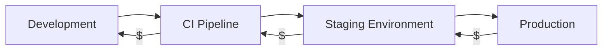
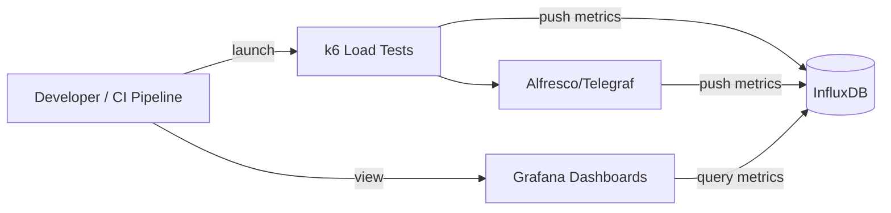
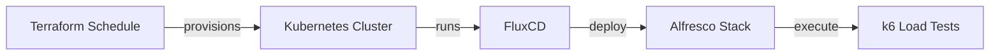
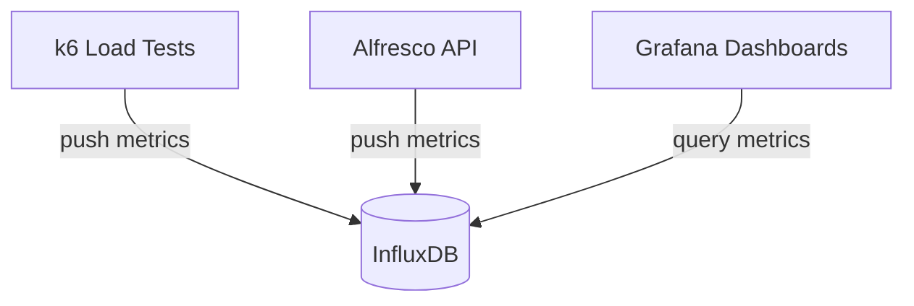

# Shift Left with Performance Testing

Giovanni Toraldo

DevFest Pisa 2026

---
layout: image-right
image: https://avatars.githubusercontent.com/u/71768
---

# About me

* Software developer
* Open Source enthusiast
* Writer and public speaker
* DevOps Engineer at Hyland (full remote)
* Sometimes I get teleported into the 14th century

---
layout: image-right
image: https://www.svgrepo.com/show/353382/alfresco.svg
backgroundSize: contain
---

# Alfresco

Open Source document, process and governance management suite.

Alfresco is designed to help organizations efficiently manage their content and
improve productivity.

---

# Ops readiness team

My team ensures that Alfresco can be deployed and operated reliably in multiple
environments. We focus on:

* Deployment automation and infrastructure as code
* Kubernetes and GitOps best practices
* CI/CD pipelines and automation
* Performance testing and monitoring 🆕

---

# Open source projects we maintain

* Containerized deployments:
  * [acs-deployment](https://github.com/Alfresco/acs-deployment) umbrella Helm
    chart for the whole stack and compose files for local development
  * [alfresco-helm-charts](https://github.com/Alfresco/alfresco-helm-charts):
    component-level charts for more flexibility
  * [alfresco-dockerfiles-bakery](https://github.com/Alfresco/alfresco-dockerfiles-bakery):
    Docker image builder for all components
* Classic deployments:
  * [alfresco-ansible](https://github.com/Alfresco/alfresco-ansible-deployment)

---

# Table of contents

1. Performance testing basics
2. Why shift left?
3. Our solution overview
4. k6 test design and examples
5. Grafana dashboards and results

---

# Performance

Performance is the **happy problem** of a software product.

It means that the software is being used, and that it is providing value to its
users.

However, when performance issues hit and make the user experience slow, it can quickly
lead to frustration and dissatisfaction.

---
layout: two-cols-header
---

# What causes performance issues?

Performance issues can be caused by a variety of factors, including:

::left::
* Database performance
  * Missing indexes
  * Connection pool exhaustion
  * I/O bottlenecks
* High memory usage
  * Unreleased resources
  * Inefficient data structures
::right::
* CPU bottlenecks
  * Inefficient algorithms
  * Lock contention
* N+1 problems
* Network latency
* No caching or ineffective caching strategies

---

# What is performance testing?

Performance testing validates how a system behaves under expected and
unexpected load. It answers questions like:

* How fast are key user journeys?
* How many users can we serve at once?
* What breaks first and why?

---

# What we measure

* Latency percentile (p50, p95, p99) of requests
* Throughput (requests per second)
* Error rates
* Resource usage (CPU, memory, I/O)

---

# Types of performance tests

* Load: expected traffic for normal conditions
* Stress: push beyond limits to find the breaking point
* Spike: sudden bursts of traffic
* Soak: long duration to find leaks and degradation

---

# Why shift left?

* Keep performance as a product feature, not a release gate
* Give developers fast, actionable feedback, not customer complaints
* Find issues when fixes are small and cheap to implement

---

# Cost of late defects

The later a performance issue is found, the more expensive it is to fix:

* **Dev**: a bug caught in a local test costs minutes
* **CI**: a regression caught costs an hour to review and fix
* **Staging**: broken feat costs a sprint delay and cross-team
  coordination
* **Production**: incident costs user trust, on-call time, and hotfix risks

Shift left = move the discovery point as early as possible.



---

# Solution overview

We use a lightweight stack that is easy to automate:

* k6: define and run load tests
* InfluxDB: store time-series metrics
* Telegraf: collect application/system metrics from the cluster
* Grafana: visualize correlated metrics



---

# Provisioning and delivery

* Nightly automated process:
  * Terraform pipeline provisions a Kubernetes cluster on demand
  * FluxCD deploys Alfresco via Helm and keeps it up to date
  * Cluster Autoscaler ready to scale nodes during load tests
  * k6 runs as a pod inside the cluster



---

# Data flow

1. k6 executes user journeys against the system under test
2. Both k6 and system metrics are pushed to InfluxDB
3. Grafana dashboards show trends and regressions for each test run



---

# K6 strengths

* Scripting in JavaScript/TypeScript with a familiar API
* Fast, headless execution
* Easy to integrate with CI pipelines
* Built-in metrics, checks and thresholds
* Integration with Grafana Cloud (not used in our case but worth mentioning)

---

# Grafana Cloud

Useful for evaluations and simpler use cases when you want less infrastructure to
manage.

* Run tests from the cloud without provisioning your own executors
* Grafana dashboards are available out of the box
* free tier with 14 days of retention
  * enough for quick evaluations

The first weeks of our project were actually run on Grafana Cloud, but we needed
more control and flexibility for our long-term goals.

---

# k6 mental model

* Virtual users (VUs): independent actors using the system concurrently
* Scenarios: control request rate and ramping up
* Iterations: define how much work each VU does

---

# k6 test script example

```js
import http from "k6/http"
import { check, sleep } from "k6"

export const options = {
  vus: 10,
  duration: "30s",
}

export default function () {
  const res = http.get(`https://${__ENV.MY_HOSTNAME}/api/health`)
  check(res, {
    "status is 200": (r) => r.status === 200,
  })
  sleep(1)
  // more complex user journey with multiple requests and checks...
}
```

---

# k6 browser

Use browser mode when you need to validate a real UI journey, not just API latency.

* Covers frontend behavior, redirects, and rendered states
* Useful for login flows, search, and other critical user journeys
* Complements API-level load tests when backend timings alone are not enough

---

# k6 browser example code

```js
const BASE_URL = __ENV.ALFRESCO_BASE_URL || 'http://localhost:8080'
await page.goto(`${BASE_URL}/share`)

// Wait for the login page to load
await page.waitForSelector('form#kc-form-login', { timeout: 5000 })

// Enter login credentials
await page.locator('input[name="username"]').type('admin')
await page.locator('input[name="password"]').type('secret')
await page.locator('input[type="submit"]').click()

// Wait for the share page to load the Quicksearch box
await page.waitForURL(`${BASE_URL}/share/dashboard`, { timeout: 30000 })
```

This code is actually used in alfresco helm chart integration tests.

---

# Scenarios and ramping

```js
export const options = {
  scenarios: {
    steady: {
      executor: "ramping-vus",
      startVUs: 0,
      stages: [
        { duration: "30s", target: 10 },
        { duration: "2m", target: 20 },
        { duration: "30s", target: 40 },
      ],
      gracefulRampDown: "30s",
    },
  },
}
```

---

# Thresholds and checks

```js
export const options = {
  thresholds: {
    http_req_failed: ["rate<0.01"], // less than 1% failed requests
    http_req_duration: ["p(95)<200"], // 95% of requests under 200ms
  },
}
```

---

# User-defined tags

* Tag can be added at multiple levels:
  * global options.tags for all metrics
  * per-request tags for specific metrics
* Useful for filtering and grouping in Grafana dashboards

---

# User-defined tags example

```js
export const options = {
  tags: {
    environment: "staging",
    alfresco_version: "26.1.0-A.1",
  },
}
```

```js
http.get("https://example.com/api/search", {
  tags: { app_feature: "indexing" },
})
```

---

# Test design tips

* Start with the top 2-3 user journeys that matter most to your users
* Use realistic datasets
* Use realistic users think time
* Keep environments consistent across runs

---

# Common pitfalls

* Ignoring warm-up and cache effects
* Not correlating with system metrics (CPU, memory, etc.)
* Overcomplicating scripts before validating the basics
* Not setting thresholds and checks to catch regressions early

---
layout: quote
---

# Running tests locally

```bash
ALFRESCO_BASE_URL=http://localhost:8080 k6 run tests/api.js
```

---

# k6 end of test results

Even without an external backend, k6 provides a summary of key metrics at the
end of each test run:

```sh
 █ THRESHOLDS

    http_req_duration
    ✓ 'p(95)<1500' p(95)=148.21ms
    ✓ 'p(90)<2000' p(90)=146.88ms

    http_req_failed
    ✓ 'rate<0.01' rate=0.00%

    HTTP
    http_req_duration..................: avg=140.36ms   min=119.08ms med=140.96ms max=154.63ms p(90)=146.88ms p(95)=148.21ms
    http_req_failed....................: 0.00%  0 out of 45
    http_reqs..........................: 45     6.56109/s
```

---

# k6 output backends

k6 supports multiple output backends beyond InfluxDB:

* **Grafana Cloud**: managed service, no infrastructure needed
* **OpenTelemetry**: send metrics to any OTLP-compatible backend
* **CSV / JSON**: simple file-based export for post-processing
* Many more via community extensions

Choose based on your existing observability stack. InfluxDB + Grafana gives you
the most control and flexibility for on-premise setups.

---

# k6 output to InfluxDB v2

```bash
K6_INFLUXDB_ORGANIZATION=<insert-here-org-name>
K6_INFLUXDB_BUCKET=<insert-here-bucket-name>
K6_INFLUXDB_TOKEN=<insert-here-valid-token>
k6 run --out xk6-influxdb=http://localhost:8086 tests/api.js
```

Additional extension is required for v2, see
[xk6-output-influxdb](https://github.com/grafana/xk6-output-influxdb).

---

# CI integration

Run k6 as part of your pipeline:

```yaml
- uses: grafana/setup-k6-action@v1
  with:
    browser: true
- uses: grafana/run-k6-action@v1
  with:
    path: |
      ./tests/api*.js
```

---

# Grafana dashboard

Key panels we track per test run:

* **Latency trends**: p50 / p95 / p99 over time per endpoint
* **Error rate**: percentage of failed requests
* **VU ramp**: active virtual users vs. request rate
* **Resource usage**: CPU and memory of the system under test

Dashboards are version-controlled alongside the k6 scripts.

---
layout: section
---

# Grafana dashboard examples

---


---


---


---


---


---


---

# What's next (lessons learned and future improvements)

Ideas to extend the current setup:

* Automated data loads in different sizes (small, medium, large)
  * Improve tooling to generate datasets bypassing APIs
* Alerts on baselines drift (capture slow degrations before they become
  regressions)

---

# Wrap-up

* Performance testing is part of the SDLC, not the release day
* k6 provides fast feedback and automation
* InfluxDB and Grafana make results visible and actionable

---
layout: image-right
image: https://sli.dev/logo-title.png
---

# Bonus: slidev

This presentation was built with [slidev](https://sli.dev), a markdown-based
presentation tool (which works great with AI agents)

---
layout: image-right
image: ./images/shift-left-with-performance-testing_toraldo_1129276_feedback-code.png
---

# Questions?

Add me on LinkedIn: [Giovanni Toraldo](https://www.linkedin.com/in/giovannitoraldo/)

Drop me an email: me @ gionn . net

Visit my blog: [gionn.net](https://gionn.net)

Slides sources on GitHub: [github.com/gionn/shift-left-perf-testing](https://github.com/gionn/shift-left-perf-testing)
