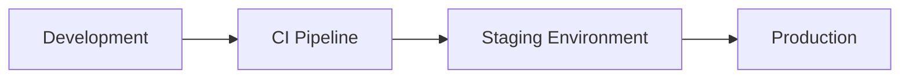
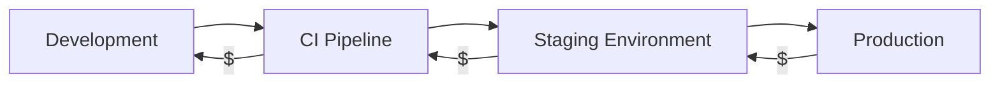
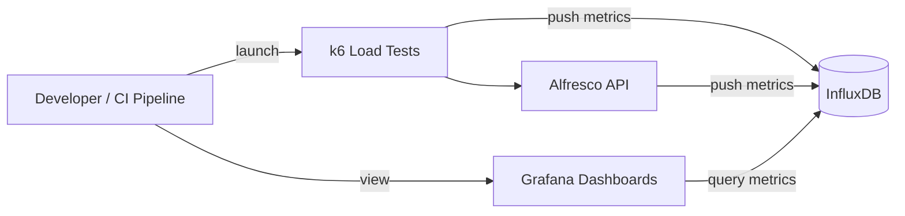
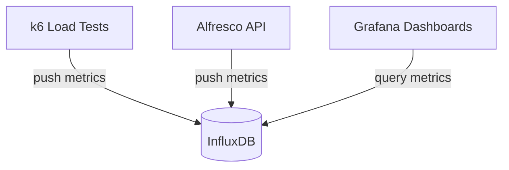

# Shift Left with Performance Testing

Giovanni Toraldo

Hyland

---
layout: image-right
image: https://avatars.githubusercontent.com/u/71768
---

# About me

* DevOps Engineer at Hyland
* Sometimes I get stuck in the past
* More about me on [gionn.net](https://gionn.net)

---
layout: image-right
image: https://www.svgrepo.com/show/353382/alfresco.svg
backgroundSize: contain
---

# Alfresco

Open Source document, process and governance management suite.

Alfresco is designed to help organizations efficiently manage their content and
improve productivity.

---

# Ops readiness team

My team ensures that Alfresco can be deployed and operated reliable in multiple
environments. We focus on:

* Helm charts and GitOps best practices
* Docker images and Compose for local development
* CI/CD pipelines and automation
* Performance testing and monitoring 🆕

---

# Open source projects we maintain

* Helm Charts
  * [Umbrella chart](https://github.com/Alfresco/acs-deployment) for all
    products
  * [Component charts](https://github.com/Alfresco/alfresco-helm-charts) for each
    product
* Docker images:
  [alfresco-dockerfiles-bakery](https://github.com/Alfresco/alfresco-dockerfiles-bakery)
* Ansible playbooks for classic deployments:
  [alfresco-ansible](https://github.com/Alfresco/alfresco-ansible-deployment)

---

# Table of contents

1. Performance testing basics
2. Why shift left?
3. Our solution: k6, InfluxDB, Grafana

---

# Performance

Performance is the happy problem of a software product.

It means that the software is being used, and that it is providing value to its
users.

However, when performance issues start to make the user slow, it can quickly
lead to frustration and dissatisfaction.

---
layout: two-cols-header
---

# What causes performance issues?

Performance issues can be caused by a variety of factors, including:

::left::
* Database performance
  * Missing indexes
  * Connection pool exhaustion
  * I/O bottlenecks
* High memory usage
  * Unreleased resources
  * Inefficient data structures
::right::
* CPU bottlenecks
  * Inefficient algorithms
  * Lock contention
* All of the above
  * N+1 problems
  * Network latency

---

# What is performance testing?

Performance testing validates how a system behaves under expected and
unexpected load. It answers questions like:

* How fast are key user journeys?
* How many users can we serve at once?
* What breaks first and why?

---

# What we measure

* Latency (p50, p95, p99)
* Throughput (requests per second)
* Error rates
* Resource usage (CPU, memory, I/O)

---

# Types of performance tests

* Load: expected traffic for normal conditions
* Stress: push beyond limits to find the breaking point
* Spike: sudden bursts of traffic
* Soak: long duration to find leaks and degradation

---

# Why shift left?

* Find regressions when changes are small and cheap to fix
* Keep performance as a product feature, not a release gate
* Give developers fast, actionable feedback, not customer complaints




---

# Cost of late defects

The later a performance issue is found, the more expensive it is to fix:

* **Dev**: a bug caught in a local test costs minutes
* **CI**: a regression caught costs an hour to review and fix
* **Staging**: broken feat costs a sprint delay and cross-team
  coordination
* **Production**: incident costs user trust, on-call time, and hotfix risks

Shift left = move the discovery point as early as possible.



---

# Solution overview

We use a lightweight stack that is easy to automate:

* k6: define and run load tests
* InfluxDB: store time-series metrics
* Grafana: visualize and share results



---

# Provisioning and delivery

* Terraform pipeline provisions a Kubernetes cluster on demand
* FluxCD deploys the Alfresco stack via Helm Charts and keeps it up to date
* Cluster Autoscaler ready to scale nodes during load tests
* k6 runs as a pod inside the cluster


---

# Data flow

1. k6 executes user journeys against the system under test
2. Both k6 and system metrics are pushed to InfluxDB
3. Grafana dashboards show trends and regressions for each test run



---

# Where it runs

* Local: quick checks during development
* CI: validate changes on every merge
* Scheduled: nightly baselines

---

# K6 strengths

* Scripting in JavaScript/TypeScript with a familiar API
* Fast, headless execution
* Built-in metrics, thresholds, and checks
* Easy to integrate with CI pipelines
* Integration with Grafana Cloud (not used in our case but worth mentioning)

---

# k6 mental model

* Virtual users (VUs) run your script in parallel
* Scenarios control arrival rate and ramping
* Iterations define how much work each VU does

---

# k6 test script example

```js
import http from "k6/http"
import { check, sleep } from "k6"

export const options = {
  vus: 10,
  duration: "30s",
}

export default function () {
  const res = http.get("https://example.com")
  check(res, {
    "status is 200": (r) => r.status === 200,
  })
  sleep(1)
  // more complex user journey with multiple requests and checks...
}
```

---

# Scenarios and ramping

```js
export const options = {
  scenarios: {
    steady: {
      executor: "ramping-vus",
      startVUs: 0,
      stages: [
        { duration: "30s", target: 10 },
        { duration: "2m", target: 20 },
        { duration: "30s", target: 40 },
      ],
      gracefulRampDown: "30s",
    },
  },
}
```

---

# Thresholds and checks

```js
export const options = {
  thresholds: {
    http_req_failed: ["rate<0.01"], // less than 1% failed requests
    http_req_duration: ["p(95)<200"], // 95% of requests under 200ms
  },
}
```

---

# Tags and trends

* Tag key requests with `tags` for per-endpoint analysis
* Use consistent test names to compare runs over time

---

# k6 output to InfluxDB v2

```bash
K6_INFLUXDB_ORGANIZATION=<insert-here-org-name>
K6_INFLUXDB_BUCKET=<insert-here-bucket-name>
K6_INFLUXDB_TOKEN=<insert-here-valid-token>
k6 run --out xk6-influxdb=http://localhost:8086 script.js
```

Additional extension is required for v2, see
[xk6-output-influxdb](https://github.com/grafana/xk6-output-influxdb).

---

# InfluxDB schema

k6 writes one measurement per metric type. Key measurements:

| Measurement | Tags | Fields |
| --- | --- | --- |
| `http_req_duration` | `name`, `status`, `method` | `value` |
| `http_req_failed` | `name` | `value` |
| `vus` | — | `value` |
| `iterations` | `scenario` | `value` |

Tag by `name` to get per-endpoint latency breakdowns in Grafana.

---

# Grafana dashboard

Key panels we track per test run:

* **Latency trends**: p50 / p95 / p99 over time per endpoint
* **Error rate**: percentage of failed requests
* **VU ramp**: active virtual users vs. request rate
* **Resource usage**: CPU and memory of the system under test

Dashboards are version-controlled alongside the k6 scripts.

---

# Test design tips

* Start with the top 2-3 user journeys
* Use realistic data and think time
* Keep environments consistent for baselines

---

# CI integration

Run k6 as part of your pipeline — fail the build on threshold breaches:

```yaml
- name: Run performance tests
  run: |
    k6 run \
      --out xk6-influxdb=http://influxdb.example.org:8086 \
      --env BASE_URL=${{ env.APP_URL }} \
      tests/load.js
```

A non-zero exit code from k6 fails the step when any threshold is exceeded.

---

# Common pitfalls

* Unrealistic traffic patterns
* Ignoring warm-up and cache effects
* Mixing load and stress goals in one test

---

# What's next

Ideas to extend the current setup:

* Browser-level tests with k6 browser for UI journeys
* Chaos engineering: inject failures during load tests
* SLO alerting: Grafana alerts when baselines drift
* Distributed k6 runs with k6 Operator on Kubernetes

---

# Wrap-up

* Performance testing is part of the SDLC, not the release day
* k6 provides fast feedback and automation
* InfluxDB and Grafana make results visible and actionable

---
layout: image-right
image: https://sli.dev/logo-title.png
---

# Bonus: slidev

This presentation was built with [slidev](https://sli.dev), a markdown-based
presentation tool (which works great with AI agents)

---
layout: image-right
image: ./images/shift-left-with-performance-testing_toraldo_1129276_feedback-code.png
---

# Questions?

Reach me on LinkedIn: [Giovanni Toraldo](https://www.linkedin.com/in/giovannitoraldo/)

or on my website [gionn.net](https://gionn.net)

Slides sources on GitHub: [github.com/gionn/shift-left-perf-testing](https://github.com/gionn/shift-left-perf-testing)
